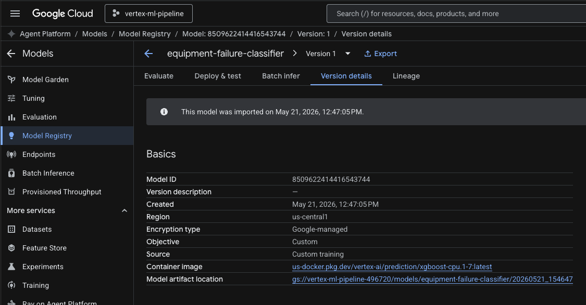
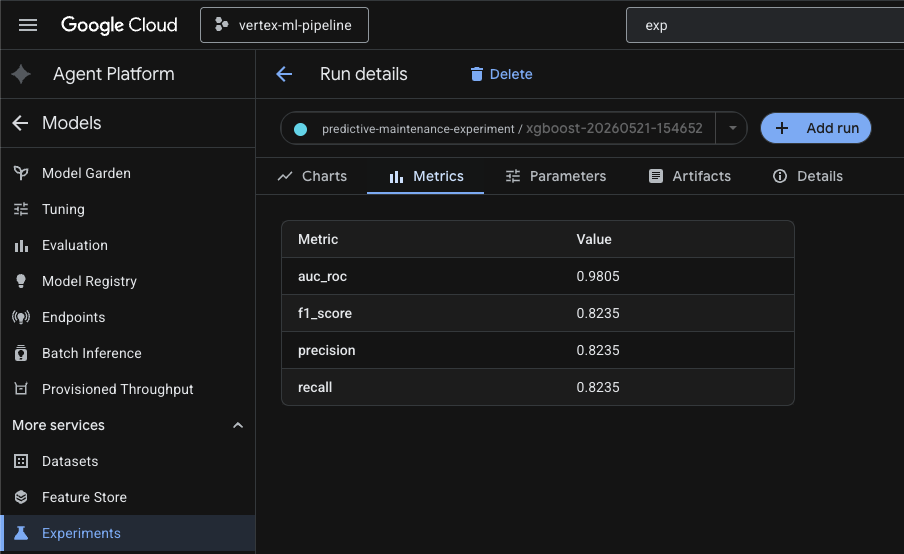
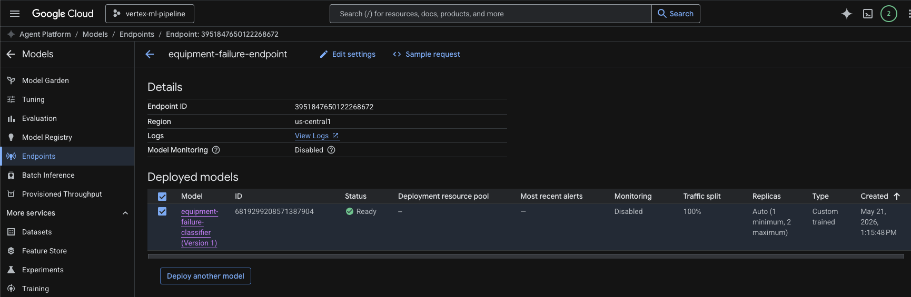
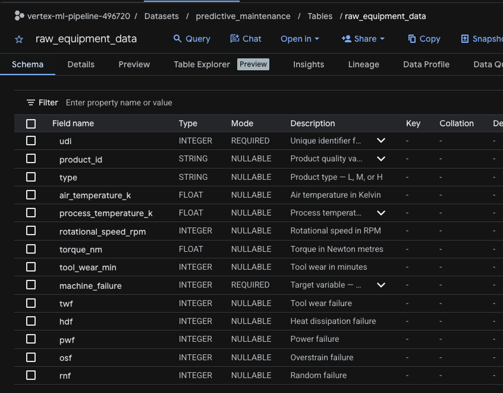
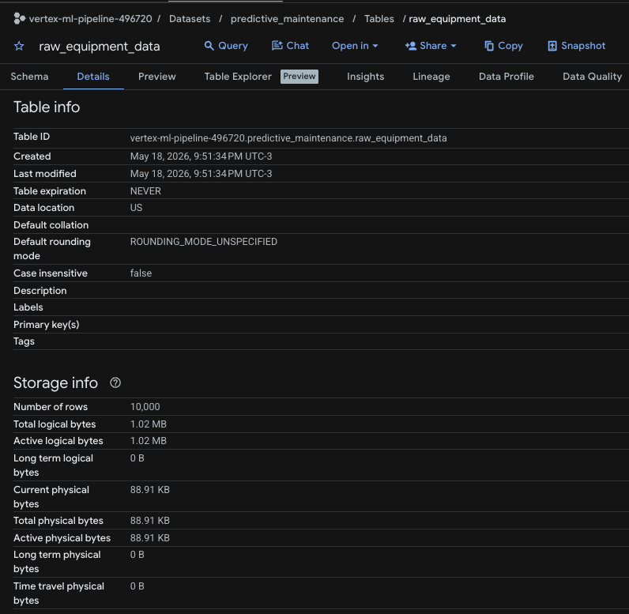
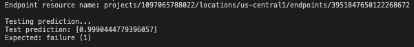

# Predictive Maintenance ML Pipeline — GCP + Vertex AI

An end-to-end machine learning pipeline for equipment failure prediction
built on Google Cloud Platform. Trains an XGBoost classifier on the UCI
AI4I 2020 Predictive Maintenance dataset, tracks experiments, registers
the model, and deploys it to a Vertex AI endpoint for real-time predictions.

## Architecture
UCI Dataset → BigQuery → EDA Notebook → XGBoost Training
↓
GCS (model artifacts)
Vertex AI Experiments (metrics)
Vertex AI Model Registry (versioned)
↓
Vertex AI Endpoint (REST API)
→ 0.999 failure probability ✓

See [docs/architecture.md](docs/architecture.md) for full details.

## Model Performance

| Metric | Value |
|---|---|
| AUC-ROC | 0.9805 |
| F1 Score | 0.8235 |
| Precision | 0.8235 |
| Recall | 0.8235 |

## Services Used

- **BigQuery** — training data storage and querying
- **Cloud Storage** — versioned model artifact storage
- **Vertex AI Workbench** — managed JupyterLab for EDA
- **Vertex AI Experiments** — hyperparameter and metric tracking
- **Vertex AI Model Registry** — model versioning and lineage
- **Vertex AI Endpoints** — real-time prediction serving
- **Artifact Registry** — Docker image storage

## Project Structure

- `setup.sh` — provisions all GCP resources
- `teardown.sh` — destroys all GCP resources
- `.env.example` — environment variable template
- `schemas/equipment_features.json` — BigQuery table schema
- `data/download_dataset.py` — downloads UCI dataset → GCS → BigQuery
- `data/requirements.txt`
- `notebooks/01_exploratory_analysis.ipynb` — EDA with feature analysis
- `training/train.py` — XGBoost training pipeline
- `training/requirements.txt`
- `serving/deploy.py` — deploys model to Vertex AI endpoint
- `serving/requirements.txt`
- `docs/architecture.md`
- `docs/training_output.txt`
- `docs/screenshots/`

## Prerequisites

- Google Cloud SDK installed and authenticated
- A GCP project with billing enabled
- Python 3.11

## Setup

### 1. Clone the repository

```bash
git clone https://github.com/YOUR_USERNAME/vertex-ml-pipeline.git
cd vertex-ml-pipeline
```

### 2. Configure environment variables

```bash
cp .env.example .env
```

Fill in your values:

```bash
GCP_PROJECT_ID=your-project-id
GCP_REGION=us-central1
BQ_LOCATION=US
BQ_DATASET=predictive_maintenance
GCS_BUCKET=vertex-ml-pipeline-your-project-id
VERTEX_EXPERIMENT=predictive-maintenance-experiment
VERTEX_MODEL_NAME=equipment-failure-classifier
ENDPOINT_NAME=equipment-failure-endpoint
```

### 3. Run setup script

```bash
./setup.sh
```

Creates BigQuery dataset, GCS bucket with folders, and Artifact Registry
repository. Enables all required APIs.

### 4. Download dataset

```bash
cd data
python -m venv venv
source venv/bin/activate
pip install -r requirements.txt
python download_dataset.py
cd ..
```

### 5. Exploratory data analysis (optional)

Create a Vertex AI Workbench instance in the GCP console, clone this repo
inside it, and open `notebooks/01_exploratory_analysis.ipynb`. Stop the
instance when done to avoid billing.

### 6. Train the model

```bash
cd training
python -m venv venv
source venv/bin/activate
pip install -r requirements.txt
python train.py
cd ..
```

This trains locally, logs metrics to Vertex AI Experiments, and registers
the model in Vertex AI Model Registry.

### 7. Deploy the model

```bash
cd serving
python -m venv venv
source venv/bin/activate
pip install -r requirements.txt
python deploy.py
cd ..
```

Deployment takes 5-10 minutes. The script tests a prediction automatically
and prints the failure probability.

**Important:** Undeploy immediately after testing to stop billing:

```bash
gcloud ai endpoints undeploy-model ENDPOINT_ID \
  --deployed-model-id=DEPLOYED_MODEL_ID \
  --region=us-central1 \
  --project=YOUR_PROJECT_ID
```

## Teardown

```bash
./teardown.sh
```

To fully remove all resources:

```bash
gcloud projects delete YOUR_PROJECT_ID
```

## Screenshots

### Model Registry


### Experiments


### Endpoint


### BigQuery Table Schema


### BigQuery Table Details


### Prediction Output


## Key Insights from EDA

- No single feature correlates strongly with failure (max 0.19) —
  failure is caused by feature interactions, not individual thresholds
- Torque and RPM have a strong inverse relationship (-0.88) — failures
  cluster at high torque + low RPM indicating mechanical binding
- Class imbalance of 97/3 handled with XGBoost scale_pos_weight=28.5
- Four engineered features improve predictive signal beyond raw features
